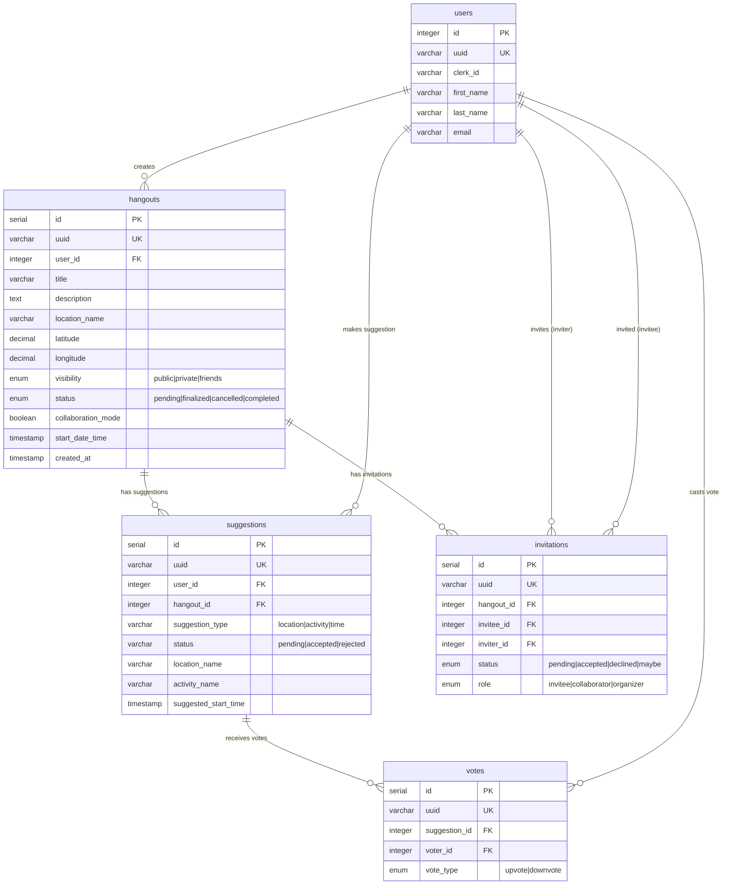
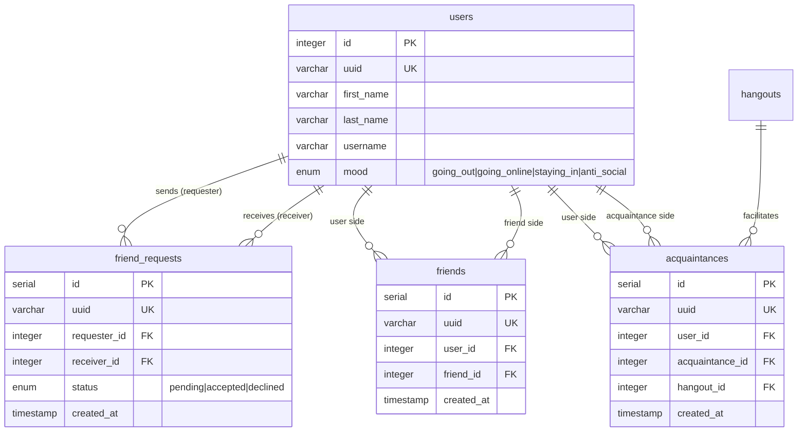
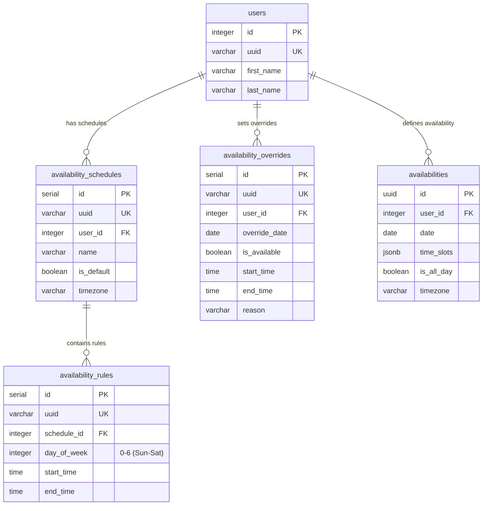
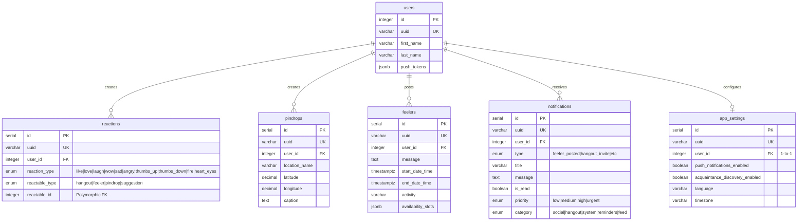
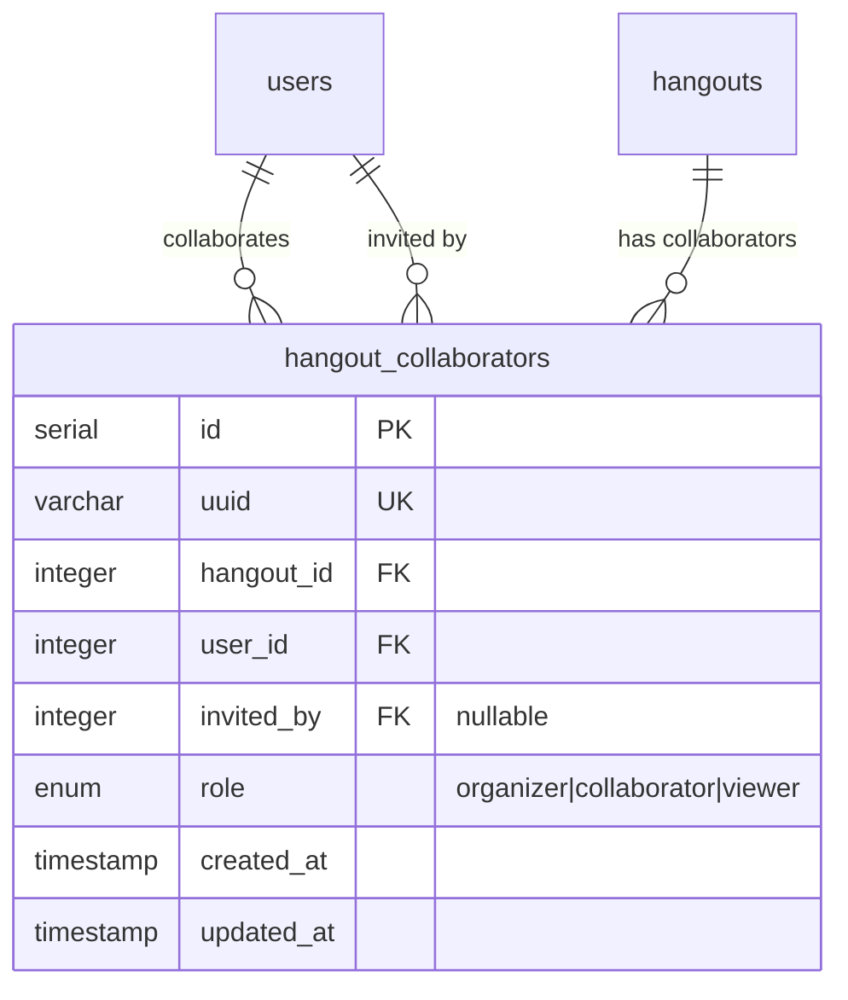

# Database Schema Documentation

This document provides a comprehensive overview of the Actually Hangout database schema using entity-relationship diagrams.

## Table of Contents
- [Complete Database Schema](#complete-database-schema)
- [Domain-Specific Diagrams](#domain-specific-diagrams)
  - [Hangout & Suggestions Domain](#1-hangout--suggestions-domain)
  - [Social Network Domain](#2-social-network-domain)
  - [Availability System Domain](#3-availability-system-domain)
  - [User Engagement Domain](#4-user-engagement-domain)
- [Missing Entity (Not in Migration)](#missing-entity-not-yet-in-migration)
- [Key Schema Insights](#key-schema-insights)

## Complete Database Schema

This diagram shows all tables and their relationships in the database.

```mermaid
erDiagram
    %% Core User Domain
    users ||--o{ hangouts : creates
    users ||--o{ suggestions : makes
    users ||--o{ pindrops : creates
    users ||--o{ reactions : creates
    users ||--o{ votes : casts
    users ||--o{ notifications : receives
    users ||--o{ feelers : posts
    users ||--o{ availability_schedules : has
    users ||--o{ availability_overrides : sets
    users ||--o{ availabilities : defines
    users ||--o| app_settings : configures

    %% Social/Friendship Domain
    users ||--o{ friend_requests : "sends (requester)"
    users ||--o{ friend_requests : "receives (receiver)"
    users ||--o{ friends : "has (user)"
    users ||--o{ friends : "befriends (friend)"
    users ||--o{ acquaintances : "meets (user)"
    users ||--o{ acquaintances : "is met by (acquaintance)"

    %% Hangout Domain
    hangouts ||--o{ suggestions : contains
    hangouts ||--o{ invitations : includes
    hangouts ||--o{ acquaintances : facilitates

    users ||--o{ invitations : "invites (inviter)"
    users ||--o{ invitations : "is invited (invitee)"
    hangouts ||--o{ invitations : has

    %% Suggestion & Voting Domain
    suggestions ||--o{ votes : receives
    users ||--o{ votes : casts

    %% Availability Domain
    availability_schedules ||--o{ availability_rules : contains

    %% Entity Definitions
    users {
        integer id PK
        varchar uuid UK
        varchar clerk_id "Auth ID"
        varchar first_name
        varchar last_name
        varchar email
        varchar phone_number UK
        varchar profile_image_url
        varchar banner_image_url
        varchar username
        timestamp birthday
        jsonb push_tokens
        enum mood "going_out|going_online|staying_in|anti_social"
        timestamp created_at
        timestamp updated_at
        timestamp last_sign_in_at
    }

    hangouts {
        serial id PK
        varchar uuid UK
        integer user_id FK
        varchar title
        text description
        varchar street1
        varchar street2
        varchar city
        varchar state
        varchar zip_code
        varchar country
        decimal longitude
        decimal latitude
        varchar location_name
        enum visibility "public|private|friends"
        enum status "pending|finalized|cancelled|completed"
        boolean collaboration_mode
        boolean group_decision_anonymous_voting_enabled
        boolean group_decision_anonymous_suggestions_enabled
        integer group_decision_suggestions_per_person
        integer group_decision_votes_per_person
        timestamp group_decision_suggestion_deadline
        timestamp group_decision_voting_deadline
        timestamp start_date_time
        timestamp end_date_time
        timestamp created_at
        timestamp updated_at
    }

    suggestions {
        serial id PK
        varchar uuid UK
        integer user_id FK
        integer hangout_id FK
        varchar suggestion_type "location|activity|time"
        varchar status "pending|accepted|rejected"
        varchar location_name
        text location_address
        decimal location_latitude
        decimal location_longitude
        varchar activity_name
        text activity_description
        date suggested_date
        timestamptz suggested_start_time
        timestamptz suggested_end_time
        varchar suggested_timezone
        text notes
        timestamp created_at
        timestamp updated_at
    }

    votes {
        serial id PK
        varchar uuid UK
        integer suggestion_id FK
        integer voter_id FK
        enum vote_type "upvote|downvote"
        timestamp created_at
        timestamp updated_at
    }

    invitations {
        serial id PK
        varchar uuid UK
        integer hangout_id FK
        integer invitee_id FK
        integer inviter_id FK
        enum status "pending|accepted|declined|maybe"
        enum role "invitee|collaborator|organizer"
        text message
        timestamp responded_at
        timestamp created_at
        timestamp updated_at
    }

    friend_requests {
        serial id PK
        varchar uuid UK
        integer requester_id FK
        integer receiver_id FK
        enum status "pending|accepted|declined"
        timestamp created_at
        timestamp updated_at
    }

    friends {
        serial id PK
        varchar uuid UK
        integer user_id FK
        integer friend_id FK
        timestamp created_at
        timestamp updated_at
    }

    reactions {
        serial id PK
        varchar uuid UK
        integer user_id FK
        enum reaction_type "like|love|laugh|wow|sad|angry|thumbs_up|thumbs_down|fire|heart_eyes"
        enum reactable_type "hangout|feeler|pindrop|suggestion"
        integer reactable_id "Polymorphic FK"
        timestamp created_at
        timestamp updated_at
    }

    pindrops {
        serial id PK
        varchar uuid UK
        integer user_id FK
        varchar street1
        varchar street2
        varchar city
        varchar state
        varchar zip_code
        varchar country
        decimal longitude
        decimal latitude
        varchar location_name
        text caption
        timestamp created_at
        timestamp updated_at
    }

    notifications {
        serial id PK
        varchar uuid UK
        integer user_id FK
        enum type "feeler_posted|hangout_availability_reminder|hangout_invite|hangout_update|hangout_reminder|hangout_cancelled|system_announcement|friendship_created"
        varchar title
        text message
        boolean is_read
        enum priority "low|medium|high|urgent"
        enum category "social|hangout|system|reminders|feed"
        jsonb metadata
        varchar action_url
        varchar action_label
        varchar group_id
        varchar batch_id
        timestamp expires_at
        timestamp created_at
        timestamp updated_at
    }

    feelers {
        serial id PK
        varchar uuid UK
        integer user_id FK
        text message
        timestamptz start_date_time
        timestamptz end_date_time
        varchar activity
        jsonb availability_slots
        timestamp created_at
        timestamp updated_at
    }

    availability_schedules {
        serial id PK
        varchar uuid UK
        integer user_id FK
        varchar name
        boolean is_default
        varchar timezone
        timestamp created_at
        timestamp updated_at
    }

    availability_rules {
        serial id PK
        varchar uuid UK
        integer schedule_id FK
        integer day_of_week "0-6"
        time start_time
        time end_time
        timestamp created_at
    }

    availability_overrides {
        serial id PK
        varchar uuid UK
        integer user_id FK
        date override_date
        boolean is_available
        time start_time
        time end_time
        varchar reason
        timestamp created_at
    }

    availabilities {
        uuid id PK
        integer user_id FK
        date date
        jsonb time_slots
        boolean is_all_day
        text note
        varchar timezone
        integer timezone_offset
        varchar source
        timestamp created_at
        timestamp updated_at
    }

    app_settings {
        serial id PK
        varchar uuid UK
        integer user_id FK "1-to-1"
        boolean push_notifications_enabled
        boolean acquaintance_discovery_enabled
        boolean pin_drop_location_masking_enabled
        varchar language
        varchar timezone
        timestamp created_at
        timestamp updated_at
    }

    acquaintances {
        serial id PK
        varchar uuid UK
        integer user_id FK
        integer acquaintance_id FK
        integer hangout_id FK
        timestamp created_at
        timestamp updated_at
    }
```



## Domain-Specific Diagrams

### 1. Hangout & Suggestions Domain

This diagram focuses on the core hangout functionality including suggestions, votes, and invitations.



### 2. Social Network Domain

This diagram shows the friend and acquaintance relationships between users.



### 3. Availability System Domain

This diagram illustrates the user availability scheduling system with schedules, rules, and overrides.



### 4. User Engagement Domain

This diagram covers user interactions including reactions, pindrops, feelers, notifications, and settings.



## Missing Entity (Not Yet in Migration)

> **Important**: The `hangout_collaborators` table has been implemented in code but is **not yet included in the database migration**. A migration must be created before this feature can be used in production.



### Migration Required

To add the `hangout_collaborators` table to the database:

```sql
-- Create enum type
CREATE TYPE "public"."hangout_collaborators_role_enum" AS ENUM('organizer', 'collaborator', 'viewer');

-- Create table
CREATE TABLE "hangout_collaborators" (
  "id" SERIAL NOT NULL,
  "uuid" character varying NOT NULL,
  "hangout_id" integer NOT NULL,
  "user_id" integer NOT NULL,
  "role" "public"."hangout_collaborators_role_enum" NOT NULL DEFAULT 'collaborator',
  "invited_by" integer,
  "created_at" TIMESTAMP NOT NULL DEFAULT now(),
  "updated_at" TIMESTAMP NOT NULL DEFAULT now(),
  CONSTRAINT "UQ_hangout_collaborators_uuid" UNIQUE ("uuid"),
  CONSTRAINT "UQ_hangout_collaborators_hangout_user" UNIQUE ("hangout_id", "user_id"),
  CONSTRAINT "PK_hangout_collaborators" PRIMARY KEY ("id")
);

-- Create indexes
CREATE INDEX "IDX_hangout_collaborators_uuid" ON "hangout_collaborators" ("uuid");
CREATE INDEX "IDX_hangout_collaborators_hangout_id" ON "hangout_collaborators" ("hangout_id");
CREATE INDEX "IDX_hangout_collaborators_user_id" ON "hangout_collaborators" ("user_id");
CREATE INDEX "IDX_hangout_collaborators_hangout_created" ON "hangout_collaborators" ("hangout_id", "created_at");

-- Create foreign keys
ALTER TABLE "hangout_collaborators"
  ADD CONSTRAINT "FK_hangout_collaborators_hangout"
  FOREIGN KEY ("hangout_id")
  REFERENCES "hangouts"("id")
  ON DELETE CASCADE;

ALTER TABLE "hangout_collaborators"
  ADD CONSTRAINT "FK_hangout_collaborators_user"
  FOREIGN KEY ("user_id")
  REFERENCES "users"("id")
  ON DELETE NO ACTION;

ALTER TABLE "hangout_collaborators"
  ADD CONSTRAINT "FK_hangout_collaborators_inviter"
  FOREIGN KEY ("invited_by")
  REFERENCES "users"("id")
  ON DELETE SET NULL;
```

## Key Schema Insights

### Unique Constraints

Most tables have a `uuid` field as a unique secondary identifier for external references. The following tables have composite unique constraints to prevent duplicates:

- **friend_requests**: `(requester_id, receiver_id)` - Prevents duplicate friend requests
- **friends**: `(user_id, friend_id)` - Ensures unique friendships
- **invitations**: `(hangout_id, invitee_id)` - One invitation per user per hangout
- **reactions**: `(user_id, reactable_type, reactable_id)` - One reaction per user per item
- **votes**: `(suggestion_id, voter_id)` - One vote per user per suggestion
- **availabilities**: `(user_id, date)` - One availability record per user per day
- **acquaintances**: `(user_id, acquaintance_id, hangout_id)` - Unique acquaintance relationships per hangout

### Performance Indexes

The schema includes strategic composite indexes for common query patterns:

#### Hangouts Table
- `(user_id, created_at)` - For fetching user's hangouts sorted by date
- `(user_id, status)` - For filtering user's hangouts by status
- `(user_id, collaboration_mode)` - For filtering collaborative hangouts
- `(user_id, start_date_time)` - For date range filtering by user
- `(visibility, created_at)` - For public hangout discovery
- `(visibility, start_date_time)` - For public hangout date filtering

#### Suggestions Table
- `(hangout_id, suggestion_type)` - For fetching suggestions by type
- `(hangout_id, status)` - For filtering pending/accepted suggestions
- Single indexes on `user_id` and `hangout_id` for foreign key lookups

#### Temporal Indexes
- Date/time fields have indexes for efficient range queries:
  - `hangouts.start_date_time`, `hangouts.end_date_time`
  - `feelers.start_date_time`, `feelers.end_date_time`
  - `availabilities.date`
  - `availability_overrides.override_date`

### Polymorphic Relationships

The **reactions** table uses polymorphic association to relate to multiple entity types:

- `reactable_type`: Enum defining the entity type (`hangout`, `feeler`, `pindrop`, `suggestion`)
- `reactable_id`: Integer ID of the related entity
- Composite unique index on `(user_id, reactable_type, reactable_id)` ensures one reaction per user per item

### Cascade Behaviors

Foreign key cascade behaviors are configured as follows:

- **CASCADE DELETE**:
  - `hangout_collaborators.hangout_id` - Deleting a hangout removes all collaborators
  - `availability_rules.schedule_id` - Deleting a schedule removes all rules
  - `availability_overrides.user_id` - Deleting a user removes their overrides

- **NO ACTION** (default):
  - Most foreign keys use `NO ACTION` to prevent accidental data loss

- **SET NULL**:
  - `hangout_collaborators.invited_by` - If inviter is deleted, field is set to null

### JSONB Fields

Several tables use JSONB for flexible, schema-less data:

- `users.push_tokens` - Array of push notification tokens
- `notifications.metadata` - Additional notification data
- `feelers.availability_slots` - Complex availability data
- `availabilities.time_slots` - Flexible time slot definitions

### Check Constraints

The schema enforces data integrity with check constraints:

- `suggestions`: Type-specific required fields (location_name for location, activity_name for activity, etc.)
- `availability_rules`:
  - `end_time > start_time`
  - `day_of_week BETWEEN 0 AND 6`
- `availability_overrides`: If times are set, `end_time > start_time`

## Schema Statistics

- **Total Tables**: 20
- **Total Enum Types**: 10
- **Polymorphic Relationships**: 1 (reactions)
- **Self-Referential Tables**: 2 (friends, friend_requests)
- **Many-to-Many Junction Tables**: 3 (friends, acquaintances, hangout_collaborators)

## Related Documentation

- See `src/db/migrations/` for the actual migration files
- See `src/**/entities/*.entity.ts` for TypeORM entity definitions
- See `ARCHITECTURE_REFACTOR.md` for high-level architecture overview
