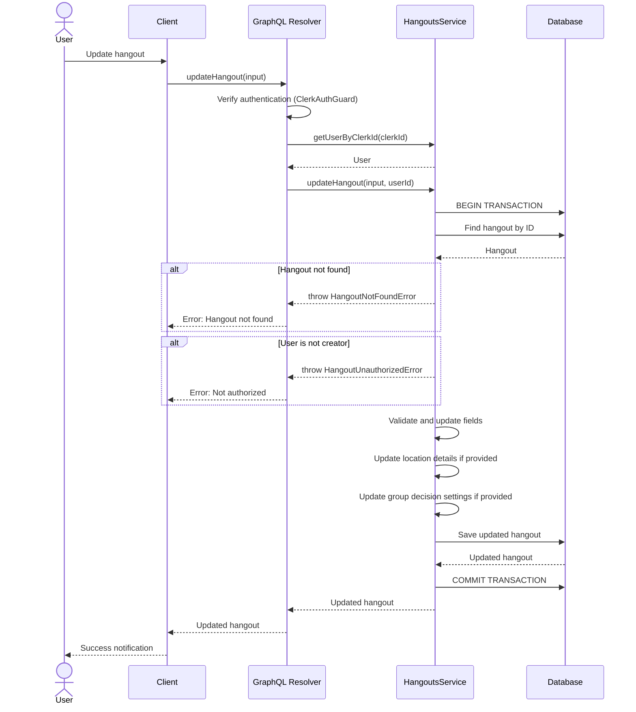
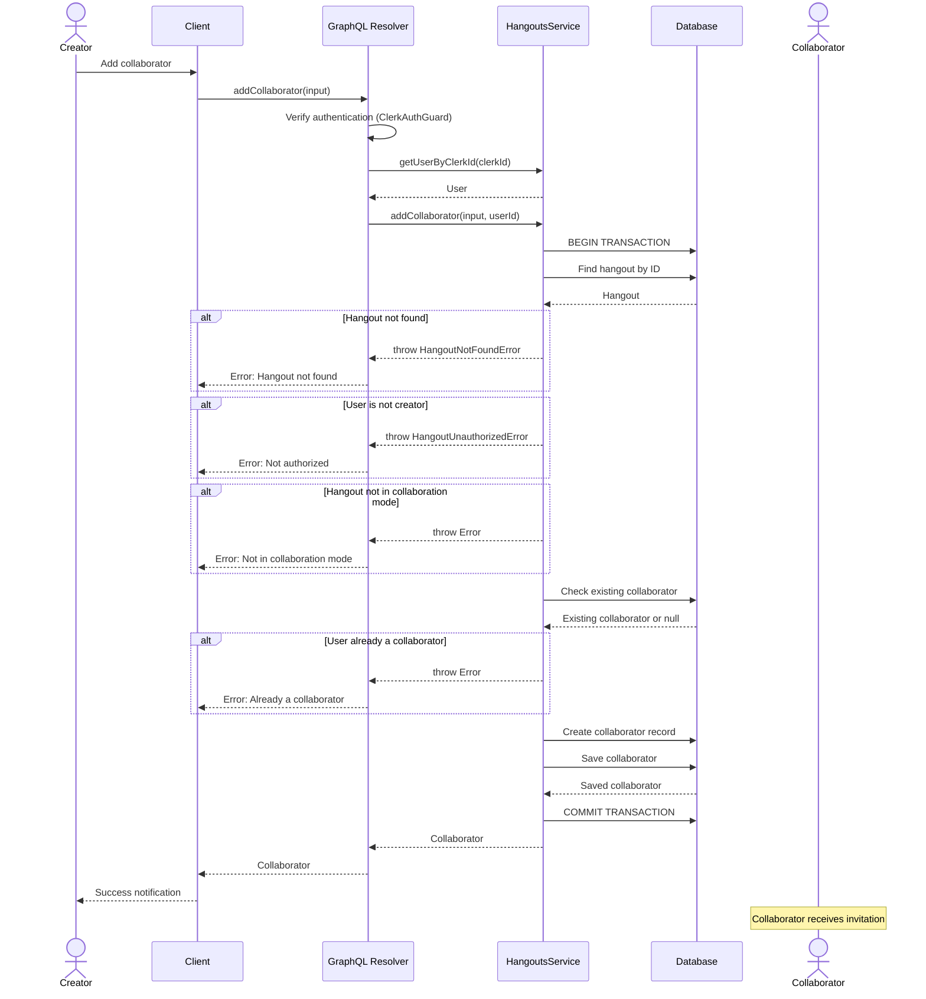
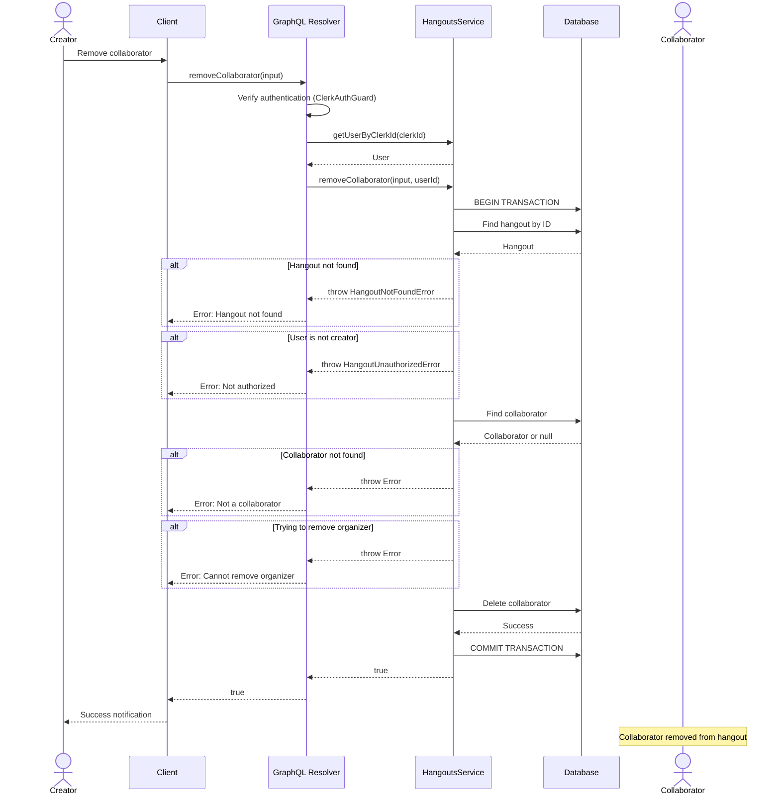
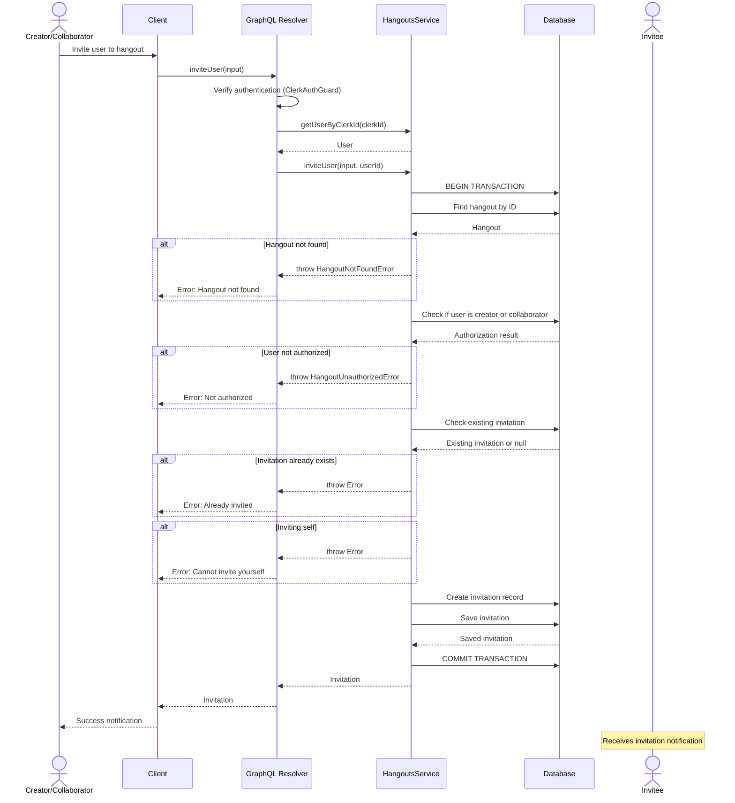
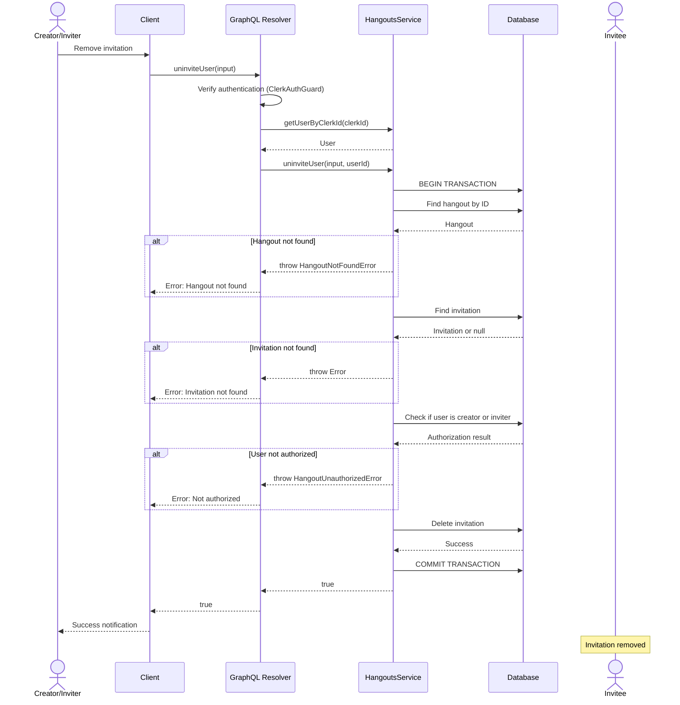
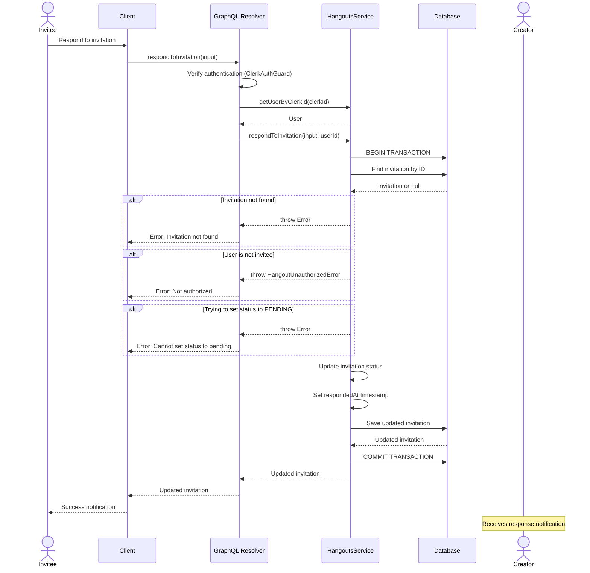
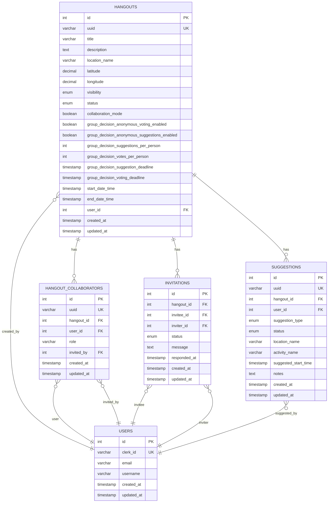

# Hangout Update Feature

## Overview

The Hangout Update feature allows hangout creators to update their hangouts and manage both collaborators and invitations. This includes:

**Hangout Updates:**
- Updating hangout properties (title, description, location, dates, etc.)

**Collaborator Management (Planning Partners):**
- Adding collaborators to hangouts in collaboration mode
- Removing collaborators from hangouts
- Collaborators help plan and organize the hangout

**Invitation Management (Guests):**
- Inviting users to attend the hangout
- Removing invitations
- Users can respond to invitations (accept, decline, maybe)
- Invitations are separate from collaborators - they represent people invited to attend, not plan

## API Endpoints

### GraphQL Mutations

#### updateHangout
Updates a hangout. Only the creator can update the hangout.

**Input:**
```graphql
input UpdateHangoutInput {
  id: Int!
  title: String
  description: String
  activity: String
  location: String
  locationDetails: HangoutLocationDetailsInput
  date: String
  visibility: HangoutVisibility
  status: HangoutStatus
  collaborationMode: Boolean
  groupDecision: GroupDecisionInput
}
```

**Returns:** `Hangout!`

#### addCollaborator
Adds a collaborator to a hangout. Only the creator can add collaborators, and the hangout must be in collaboration mode.

**Input:**
```graphql
input AddCollaboratorInput {
  hangoutId: Int!
  userId: Int!
  role: CollaboratorRole
}
```

**Returns:** `HangoutCollaborator!`

#### removeCollaborator
Removes a collaborator from a hangout. Only the creator can remove collaborators. Cannot remove the organizer.

**Input:**
```graphql
input RemoveCollaboratorInput {
  hangoutId: Int!
  userId: Int!
}
```

**Returns:** `Boolean!`

#### inviteUser
Invites a user to attend a hangout. Creator or collaborators can invite users.

**Input:**
```graphql
input InviteUserInput {
  hangoutId: Int!
  inviteeId: Int!
  message: String
}
```

**Returns:** `Invitation!`

#### uninviteUser
Removes an invitation from a hangout. Only creator or the original inviter can remove.

**Input:**
```graphql
input UninviteUserInput {
  hangoutId: Int!
  inviteeId: Int!
}
```

**Returns:** `Boolean!`

#### respondToInvitation
Allows an invitee to respond to an invitation.

**Input:**
```graphql
input RespondToInvitationInput {
  invitationId: Int!
  status: InvitationStatus!  # ACCEPTED, DECLINED, or MAYBE
}
```

**Returns:** `Invitation!`

### GraphQL Queries

#### getInvitations
Retrieves invitations with filtering and cursor-based pagination.

**Input:**
```graphql
input GetInvitationsInput {
  hangoutId: Int
  inviteeId: Int
  status: InvitationStatus
  first: Int
  after: String
}
```

**Returns:** `InvitationConnection!`

## Sequence Diagrams

### Update Hangout Flow



### Add Collaborator Flow



### Remove Collaborator Flow



### Invite User Flow



### Uninvite User Flow



### Respond to Invitation Flow



## Data Model

### Hangout Entity Relationships



## Authorization Rules

### Update Hangout
- ✅ User must be authenticated
- ✅ User must be the creator (owner) of the hangout
- ✅ Hangout must exist

### Add Collaborator
- ✅ User must be authenticated
- ✅ User must be the creator (owner) of the hangout
- ✅ Hangout must exist
- ✅ Hangout must be in collaboration mode
- ✅ Target user cannot already be a collaborator

### Remove Collaborator
- ✅ User must be authenticated
- ✅ User must be the creator (owner) of the hangout
- ✅ Hangout must exist
- ✅ Target user must be an existing collaborator
- ✅ Cannot remove a collaborator with ORGANIZER role

### Invite User
- ✅ User must be authenticated
- ✅ User must be the creator OR a collaborator on the hangout
- ✅ Hangout must exist
- ✅ Invitee cannot already be invited
- ✅ User cannot invite themselves

### Uninvite User
- ✅ User must be authenticated
- ✅ User must be the creator OR the original inviter
- ✅ Hangout must exist
- ✅ Invitation must exist

### Respond to Invitation
- ✅ User must be authenticated
- ✅ User must be the invitee
- ✅ Invitation must exist
- ✅ Cannot set status to PENDING (must be ACCEPTED, DECLINED, or MAYBE)

### Get Invitations
- ✅ User must be authenticated
- ✅ Filters by hangoutId, inviteeId, and/or status (all optional)
- ✅ Supports cursor-based pagination

## Validation Rules

### Update Hangout
- Title: max 255 characters (if provided)
- Description: max 5000 characters (if provided)
- Activity: max 255 characters (if provided)
- Location: max 255 characters (if provided)
- Date: valid ISO 8601 timestamp (if provided)
- Latitude: -90 to 90 (if provided)
- Longitude: -180 to 180 (if provided)
- Visibility: must be PUBLIC, PRIVATE, or FRIENDS (if provided)
- Status: must be PENDING, FINALIZED, CANCELLED, or COMPLETED (if provided)

### Group Decision Settings (when collaboration mode is enabled)
- Suggestion deadline: must be in the future
- Voting deadline: must be in the future
- Suggestion deadline: must be before voting deadline
- Votes per person: 1-10
- Options per person: 1-10

### Invite User
- Hangout ID: positive integer (required)
- Invitee ID: positive integer (required)
- Message: max 500 characters (optional)

### Respond to Invitation
- Invitation ID: positive integer (required)
- Status: must be ACCEPTED, DECLINED, or MAYBE (required)
- Cannot set status to PENDING

### Get Invitations
- Hangout ID: positive integer (optional)
- Invitee ID: positive integer (optional)
- Status: valid InvitationStatus enum value (optional)
- First: pagination limit (optional, default from GraphQL schema)
- After: cursor for pagination (optional)

## Error Handling

### Common Errors

| Error | HTTP Status | GraphQL Error | Description |
|-------|-------------|---------------|-------------|
| User not found | 401 | UNAUTHENTICATED | User's Clerk ID not found in database |
| Hangout not found | 404 | NOT_FOUND | Hangout with specified ID doesn't exist |
| Not authorized | 403 | FORBIDDEN | User is not the creator of the hangout |
| Invalid date format | 400 | BAD_USER_INPUT | Date string is not a valid ISO 8601 timestamp |
| Deadline in past | 400 | BAD_USER_INPUT | Group decision deadline is not in the future |
| Invalid deadline order | 400 | BAD_USER_INPUT | Suggestion deadline is after voting deadline |
| Not in collaboration mode | 400 | BAD_USER_INPUT | Attempting to add collaborators to non-collaborative hangout |
| Already a collaborator | 409 | CONFLICT | User is already a collaborator on this hangout |
| Cannot remove organizer | 403 | FORBIDDEN | Attempting to remove a user with ORGANIZER role |
| Already invited | 409 | CONFLICT | User is already invited to this hangout |
| Cannot invite yourself | 400 | BAD_USER_INPUT | User attempted to invite themselves |
| Invitation not found | 404 | NOT_FOUND | Invitation with specified ID doesn't exist |
| Not invitee | 403 | FORBIDDEN | User attempting to respond is not the invitee |
| Cannot set pending status | 400 | BAD_USER_INPUT | Cannot set invitation status to PENDING |

## Examples

### Update Hangout Title and Description

```graphql
mutation {
  updateHangout(input: {
    id: 1
    title: "Updated Hangout Title"
    description: "This is the updated description"
  }) {
    id
    title
    description
    updatedAt
  }
}
```

### Update Hangout with Location Details

```graphql
mutation {
  updateHangout(input: {
    id: 1
    location: "Central Park"
    locationDetails: {
      coordinates: {
        latitude: 40.7829
        longitude: -73.9654
      }
      fullAddress: "Central Park, New York, NY 10024"
      placedFormatted: "Central Park"
    }
  }) {
    id
    location
    locationDetails {
      coordinates {
        latitude
        longitude
      }
      fullAddress
      placedFormatted
    }
  }
}
```

### Change Hangout to Collaboration Mode

```graphql
mutation {
  updateHangout(input: {
    id: 1
    collaborationMode: true
    groupDecision: {
      voting: {
        anonymousVotes: true
        anonymousSuggestions: false
        votesPerPerson: 3
        optionsPerPerson: 2
      }
      openForSuggestions: {
        location: true
        activity: true
        dateTime: true
      }
      deadlines: {
        suggestion: "2024-12-20T10:00:00Z"
        voting: "2024-12-22T10:00:00Z"
      }
      notifications: {
        newSuggestions: true
        votingUpdates: true
        deadlineReminders: true
      }
    }
  }) {
    id
    collaborationMode
    groupDecisionSettings {
      voting {
        anonymousVotes
        votesPerPerson
      }
      deadlines {
        suggestion
        voting
      }
    }
  }
}
```

### Add Collaborator

```graphql
mutation {
  addCollaborator(input: {
    hangoutId: 1
    userId: 2
    role: COLLABORATOR
  }) {
    id
    userId
    role
    invitedBy
    createdAt
  }
}
```

### Remove Collaborator

```graphql
mutation {
  removeCollaborator(input: {
    hangoutId: 1
    userId: 2
  })
}
```

### Invite User to Hangout

```graphql
mutation {
  inviteUser(input: {
    hangoutId: 1
    inviteeId: 3
    message: "Hey! Would love for you to join us at this hangout. It's going to be fun!"
  }) {
    id
    hangoutId
    inviteeId
    inviterId
    status
    message
    createdAt
  }
}
```

### Uninvite User from Hangout

```graphql
mutation {
  uninviteUser(input: {
    hangoutId: 1
    inviteeId: 3
  })
}
```

### Respond to Invitation

```graphql
mutation {
  respondToInvitation(input: {
    invitationId: 1
    status: ACCEPTED
  }) {
    id
    hangoutId
    inviteeId
    inviterId
    status
    respondedAt
    createdAt
  }
}
```

### Query Invitations for a Hangout

```graphql
query {
  getInvitations(input: {
    hangoutId: 1
    status: PENDING
    first: 10
  }) {
    edges {
      node {
        id
        inviteeId
        inviterId
        status
        message
        createdAt
      }
      cursor
    }
    pageInfo {
      hasNextPage
      hasPreviousPage
      startCursor
      endCursor
    }
    totalCount
  }
}
```

### Query Invitations for a User

```graphql
query {
  getInvitations(input: {
    inviteeId: 3
    status: PENDING
    first: 10
  }) {
    edges {
      node {
        id
        hangoutId
        inviterId
        status
        message
        createdAt
      }
      cursor
    }
    pageInfo {
      hasNextPage
      endCursor
    }
    totalCount
  }
}
```

## Testing

### Unit Tests

Unit tests cover:

**Hangout Updates:**
- ✅ Updating hangouts with all fields
- ✅ Updating hangouts with partial fields
- ✅ Authorization checks (creator-only access)
- ✅ Validation of dates and deadlines
- ✅ Location details handling
- ✅ Group decision settings validation

**Collaborator Management:**
- ✅ Adding collaborators with proper authorization
- ✅ Preventing duplicate collaborators
- ✅ Removing collaborators
- ✅ Preventing removal of organizers

**Invitation Management:**
- ✅ Inviting users to hangouts (creator and collaborators)
- ✅ Preventing duplicate invitations
- ✅ Preventing self-invitations
- ✅ Authorization checks for invite/uninvite operations
- ✅ Removing invitations (creator and original inviter)
- ✅ Responding to invitations (accept, decline, maybe)
- ✅ Preventing non-invitees from responding
- ✅ Preventing setting status to PENDING
- ✅ Recording respondedAt timestamp

**General:**
- ✅ Error handling for all edge cases
- ✅ Database transaction integrity

### Integration Tests

To be implemented:
- End-to-end GraphQL mutation tests for updates
- End-to-end GraphQL mutation tests for collaborators
- End-to-end GraphQL mutation tests for invitations
- Database transaction rollback tests
- Concurrent update handling
- Collaboration mode state transitions
- Invitation notification delivery
- Pagination for invitation queries

## Performance Considerations

### Database Operations

1. **Transactions**: All update operations use database transactions to ensure atomicity
2. **Indexes**: The following indexes are used for efficient queries:
   - `hangouts.id` (primary key)
   - `hangouts.user_id` (for creator lookups)
   - `hangout_collaborators.hangout_id` (for collaborator queries)
   - `hangout_collaborators(hangout_id, user_id)` (unique constraint)
   - `invitations.hangout_id` (for invitation queries by hangout)
   - `invitations.invitee_id` (for invitation queries by invitee)
   - `invitations(hangout_id, invitee_id)` (unique constraint)

### Caching

Currently, hangout updates invalidate cached data through the standard update timestamp mechanism. Consider implementing:
- Cache invalidation for related entities (collaborators, suggestions)
- Optimistic locking for concurrent updates

## Future Enhancements

### Collaborator Management
1. **Batch Operations**: Add ability to add/remove multiple collaborators in a single request
2. **Role Management**: Add ability to update collaborator roles
3. **Permissions**: Add fine-grained permissions for different collaborator roles

### Invitation Management
1. **Batch Invitations**: Send invitations to multiple users at once
2. **Invitation Templates**: Pre-defined invitation message templates
3. **Invitation Limits**: Set maximum number of invitations per hangout
4. **Invitation Expiry**: Auto-expire invitations after a certain time
5. **Push Notifications**: Send push notifications when invitations are sent/responded to
6. **Email Notifications**: Send email notifications for invitations

### General
1. **History Tracking**: Track change history for hangout updates
2. **Notifications**: Send notifications to collaborators when hangout details change
3. **Audit Log**: Maintain audit trail of all hangout modifications
4. **Real-time Updates**: Use WebSocket subscriptions for real-time invitation updates
