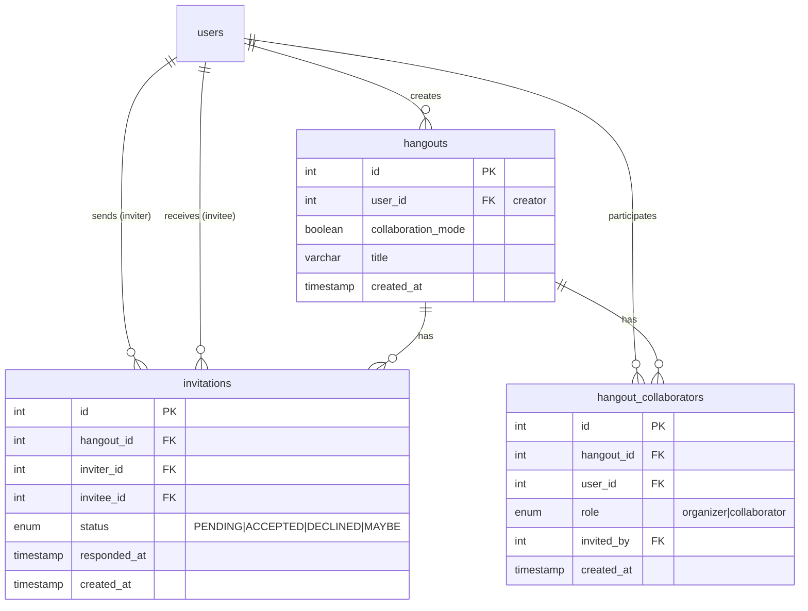
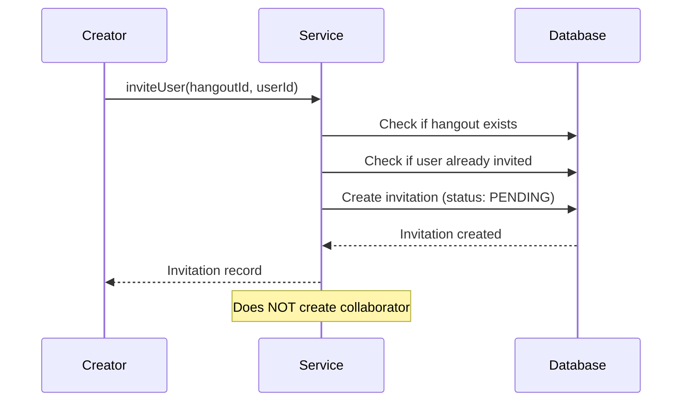
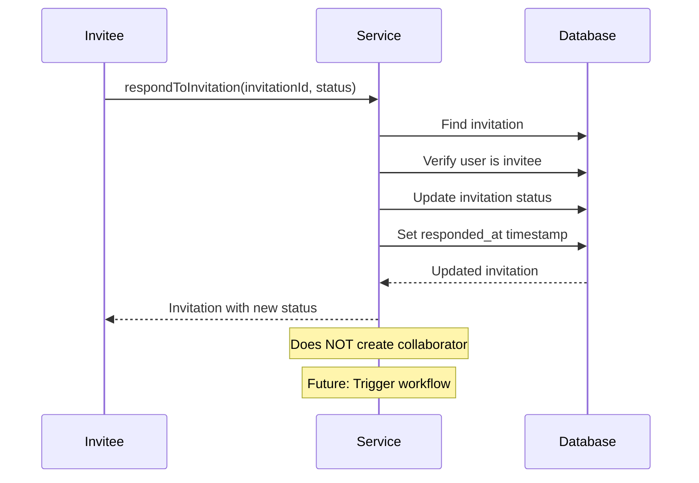
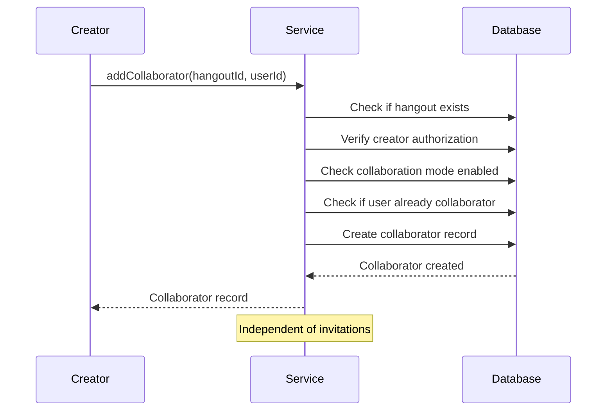
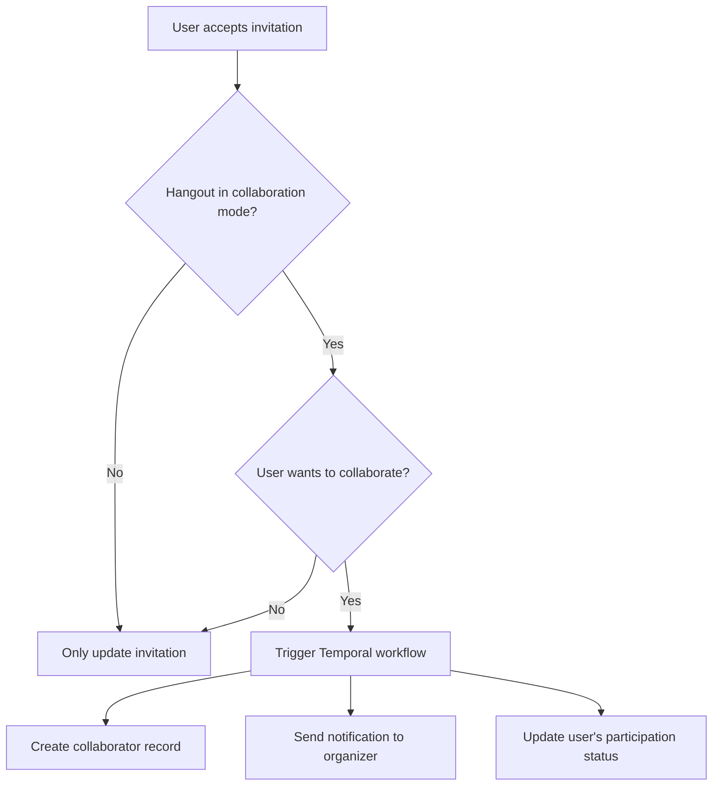

# Invitation and Collaborator Relationship

**Date:** October 31, 2025
**Status:** Current Implementation + Future Enhancements

## Overview

This document explains the relationship between **Invitations** and **Collaborators** in the hangout system, including current functionality and planned enhancements.

## Key Concepts

### Invitations
**Purpose:** Track who has been invited to a hangout and their RSVP status

**Lifecycle:**
1. Created when a user invites someone to a hangout
2. Updated when the invitee responds (accepted, declined, maybe)
3. Remains in the database as a historical record

**Key Fields:**
- `inviter_id`: Who sent the invitation
- `invitee_id`: Who received the invitation
- `hangout_id`: Which hangout they're invited to
- `status`: PENDING | ACCEPTED | DECLINED | MAYBE
- `responded_at`: When they responded

### Collaborators
**Purpose:** Track who is actively participating in hangout planning

**Lifecycle:**
1. Organizer is automatically added as a collaborator when hangout is created in collaboration mode
2. Additional collaborators added explicitly by the organizer
3. Removed when no longer needed or hangout ends

**Key Fields:**
- `user_id`: The collaborating user
- `hangout_id`: Which hangout they're collaborating on
- `role`: organizer | collaborator
- `invited_by`: Who added them as a collaborator

## Current Relationships



## Key Differences

| Aspect | Invitations | Collaborators |
|--------|-------------|---------------|
| **Purpose** | Track RSVP responses | Track active participants in planning |
| **Who Can Create** | Hangout creator or collaborators (in collaboration mode) | Only hangout creator |
| **Automatic Creation** | No | Yes (organizer when hangout created) |
| **Status Tracking** | Yes (pending/accepted/declined/maybe) | No |
| **Participation** | Social invitation | Active planning role |
| **Required For** | Attending the hangout | Making suggestions, voting, etc. |

## Current Flow

### Inviting a User



### Responding to Invitation



### Adding a Collaborator



## Important: These Are Separate Systems

**Invitations and Collaborators do NOT automatically sync.**

- Accepting an invitation does NOT make you a collaborator
- Being a collaborator does NOT mean you were invited
- You can be invited without being a collaborator
- You can be a collaborator without being invited

## Use Cases

### Use Case 1: Simple Hangout (No Collaboration Mode)
```
1. Alice creates a hangout (collaboration_mode: false)
2. Alice invites Bob and Charlie
   - Creates invitation records
   - Does NOT create collaborator records
3. Bob accepts, Charlie declines
   - Updates invitation statuses
   - Still no collaborator records
4. Only Alice can modify the hangout
```

### Use Case 2: Collaborative Hangout
```
1. Alice creates a hangout (collaboration_mode: true)
   - Alice automatically becomes a collaborator (role: organizer)
2. Alice adds Bob as a collaborator
   - Creates collaborator record (role: collaborator)
   - Bob can now make suggestions, vote, etc.
3. Alice invites Charlie
   - Creates invitation record
   - Charlie is NOT yet a collaborator
4. Charlie accepts invitation
   - Updates invitation status
   - Charlie still NOT a collaborator
5. Alice adds Charlie as a collaborator
   - Creates collaborator record
   - Charlie can now participate in planning
```

### Use Case 3: Current Workaround
```
If you want invitees to collaborate:
1. Invite them (creates invitation)
2. Wait for acceptance (they respond)
3. Manually add them as collaborator (if needed)
```

## Future Enhancements

### Planned: Automatic Collaborator Creation



### Planned Workflow: `invitation-accepted.workflow.ts`

**Activities:**
1. `checkHangoutCollaborationMode`: Verify hangout allows collaboration
2. `createCollaboratorIfNeeded`: Create collaborator record
3. `sendNotificationToOrganizer`: Notify about new participant
4. `logAcceptanceEvent`: Record for analytics

**Triggers:**
- When invitation status changes to ACCEPTED
- Only if hangout is in collaboration mode
- Only if user confirms they want to collaborate

### Planned: Invitation-Based Permissions

Future enhancement to allow accepted invitees to:
- View hangout details
- Add suggestions (if collaboration enabled)
- Vote on options (if collaboration enabled)
- See other participants

Without requiring explicit collaborator status.

## Migration Path

### Phase 1: Current (Implemented)
- Invitations and collaborators are separate
- Manual process to add collaborators
- Clear documentation of the relationship

### Phase 2: Workflow Integration (Next)
- Add Temporal workflow for invitation acceptance
- Automatic collaborator creation (opt-in)
- Notification system integration

### Phase 3: Unified Experience (Future)
- Invitees automatically get appropriate permissions
- Simplified UI/UX
- Smart defaults based on hangout type

## Developer Guidelines

### When Creating Invitations
```typescript
// ✅ Good: Clear that invitation doesn't create collaborator
await hangoutsService.inviteUser({
  hangoutId: 1,
  inviteeId: 2,
  message: 'Join us for dinner!',
});

// Then, if needed:
await hangoutsService.addCollaborator({
  hangoutId: 1,
  userId: 2,
  role: CollaboratorRole.COLLABORATOR,
});
```

### When Checking Permissions
```typescript
// Check if user is collaborator (for planning actions)
const isCollaborator = await hasCollaboratorAccess(hangoutId, userId);

// Check if user is invited (for RSVP status)
const invitation = await getInvitation(hangoutId, userId);

// Don't assume one implies the other!
```

### Logging Best Practices
```typescript
// Always log both statuses separately
this.logger.log({
  message: 'User interaction with hangout',
  hangoutId,
  userId,
  isInvited: !!invitation,
  invitationStatus: invitation?.status,
  isCollaborator: !!collaborator,
  collaboratorRole: collaborator?.role,
});
```

## Common Questions

**Q: Why aren't these combined into one table?**
A: They serve different purposes. Invitations track social RSVP (yes/no/maybe), while collaborators track active planning participation. Keeping them separate allows for more flexibility.

**Q: When should I use invitations vs. collaborators?**
A: Use invitations for: social invites, tracking RSVPs, attendance management. Use collaborators for: planning permissions, suggestion/voting rights, active participation.

**Q: Can I be a collaborator without being invited?**
A: Yes! The hangout creator can add any user as a collaborator directly, regardless of invitation status.

**Q: What happens if I decline an invitation but I'm already a collaborator?**
A: Your collaborator status is unaffected. You can still participate in planning even if you declined the social invitation.

## Related Documentation

- [Invitation Security Fixes](./invitation-security-fixes.md)
- [Database Schema](./database-schema.md)
- [Hangout Update Feature](./hangout-update-feature.md)

## Future Workflow Implementation

See TODO in `src/hangouts/hangouts.service.ts:respondToInvitation()` for:
- Notification workflow trigger points
- Auto-collaborator creation logic
- Event tracking requirements
