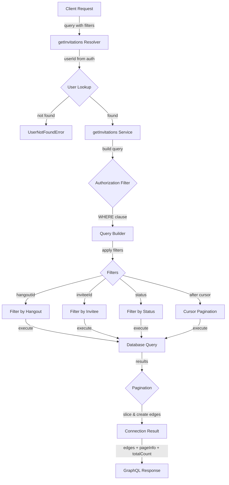
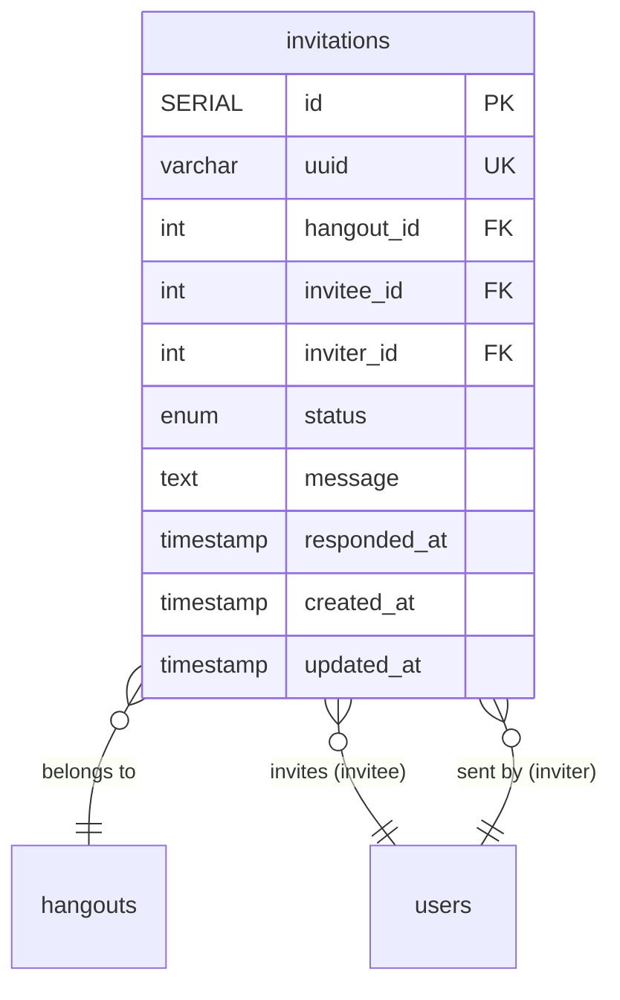
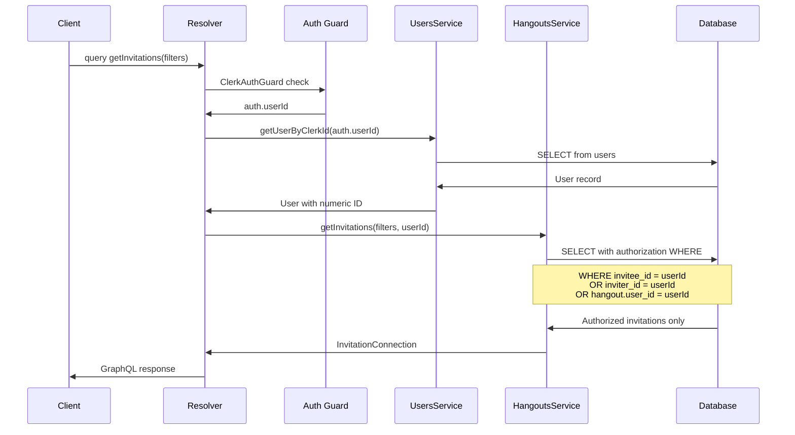

# Invitation Security Fixes and Code Review Implementation

**Date:** October 31, 2025
**Status:** Completed

## Overview

This document details the implementation of critical security and code quality fixes for the hangout invitations feature, addressing all Priority 1 items from the code review.

## Changes Implemented

### 1. Security Fix: getInvitations Authorization ✅

**Issue:** The `getInvitations` query had no authorization checks, allowing any authenticated user to query any invitation in the system.

**Fix:**
- Added authorization checks to ensure users can only see invitations where they are:
  - The invitee (they were invited)
  - The inviter (they sent the invitation)
  - The hangout creator (they can see all invitations to their hangout)

**Implementation:**
- Updated `HangoutsResolver.getInvitations()` to get the requesting user's ID and pass it to the service
- Modified `HangoutsService.getInvitations()` to accept `requestingUserId` parameter
- Added SQL WHERE clause to filter invitations based on authorization:
  ```sql
  (invitation.invitee_id = :requestingUserId
   OR invitation.inviter_id = :requestingUserId
   OR hangout.user_id = :requestingUserId)
  ```
- Applied the same authorization filter to both the main query and the count query

**Files Modified:**
- `src/hangouts/hangouts.resolver.ts:887-951`
- `src/hangouts/hangouts.service.ts:1359-1503`

### 2. Database Migration for Invitations Table ✅

**Status:** Already Exists

The invitations table was properly created in the initial schema migration:
- `src/db/migrations/1759177985030-InitialSchema.ts:158-185`

The table includes:
- Primary key `id` (SERIAL)
- Unique UUID for external references
- Foreign keys to `hangouts`, `users` (invitee), and `users` (inviter)
- Enum types for `status` and `role`
- Proper indexes for query performance

### 3. Resolve PageInfo Type Duplication ✅

**Issue:** The `PageInfo` type was duplicated in two files:
- `src/hangouts/types/hangout-collaborator-connection.types.ts`
- `src/hangouts/types/invitation-connection.types.ts`

**Fix:**
- Created a shared `PageInfo` type in `src/hangouts/types/common-connection.types.ts`
- Updated both connection type files to import from the shared type
- Updated `HangoutsService` imports to use the shared type

**Files Created:**
- `src/hangouts/types/common-connection.types.ts`

**Files Modified:**
- `src/hangouts/types/hangout-collaborator-connection.types.ts`
- `src/hangouts/types/invitation-connection.types.ts`
- `src/hangouts/hangouts.service.ts:16-40`

### 4. InvitationRole Removal ✅

**Issue:** The `InvitationRole` enum was defined but not meaningfully used in business logic.

**Decision:** Remove the unused enum and column to avoid confusion.

**Fix:**
- Removed `InvitationRole` enum from `Invitation` entity
- Removed `role` field and its index from the entity
- Generated database migration to drop the column and enum type:
  - `src/db/migrations/1761955784383-RemoveInvitationRoleColumn.ts`

The migration:
1. Drops the role index (`IDX_20e858a379731ab7f95c14a977`)
2. Drops the role column from invitations table
3. Drops the `invitations_role_enum` type

**Files Modified:**
- `src/hangouts/entities/invitation.entity.ts:15-35`

**Files Created:**
- `src/db/migrations/1761955784383-RemoveInvitationRoleColumn.ts`

### 5. Add Tests for getInvitations Authorization ✅

**Tests Added:**

Comprehensive test coverage for the `getInvitations` method including:

**Authorization Tests:**
- Returns invitations where user is the invitee
- Returns invitations where user is the inviter
- Applies authorization filter to count query

**Filter Tests:**
- Applies hangoutId filter
- Applies inviteeId filter
- Applies status filter

**Pagination Tests:**
- Respects pagination limits
- Limits page size to maximum of 100
- Handles cursor pagination
- Throws error for invalid cursor
- Calculates hasNextPage correctly when more results exist
- Sets hasNextPage to false when no more results
- Generates proper cursors for edges

**Total:** 13 new tests added

**Files Modified:**
- `src/hangouts/hangouts.service.spec.ts:2482-2772`

## GraphQL Connection Pattern

The `getInvitations` query follows the GraphQL Cursor Connections Specification:



## Database Schema Changes



**Indexes:**
- `id` (Primary Key)
- `uuid` (Unique)
- `(hangout_id, invitee_id)` (Unique Composite)
- `invitee_id`
- `inviter_id`
- `hangout_id`
- `status`
- `created_at`

**Note:** The `role` index was removed as part of this fix.

## Authorization Flow



## Test Coverage

All changes are fully tested with unit tests that:
- Follow the project convention of not using "should" in test descriptions
- Test both positive and negative cases
- Verify authorization logic
- Validate pagination behavior
- Check filter application
- Ensure proper error handling

**Total Test Count:** 221 tests (all passing)
**New Tests:** 13 tests for getInvitations

## Running the Changes

### Apply Database Migration

```bash
# Development
pnpm migration:run

# Production (automatic on deployment)
```

### Run Tests

```bash
# All tests
pnpm test

# Specific test file
pnpm test -- hangouts.service.spec.ts

# With coverage
pnpm test:cov
```

### Verify Linting

```bash
# Run linter with auto-fix
pnpm lint

# Run full check (tests + lint + format)
pnpm clean
```

## Security Considerations

### Before Fix
- **Vulnerability:** Any authenticated user could query all invitations in the system
- **Risk:** High - Privacy violation, data exposure
- **Impact:** Users could see who invited whom to which hangouts

### After Fix
- **Authorization:** Users can only see invitations where they have a legitimate relationship
- **Query Optimization:** Authorization filter applied at database level, not in application code
- **Performance:** Indexed columns used in WHERE clause for optimal query performance

## Performance Impact

- **Query Complexity:** Minimal increase due to JOIN with hangouts table for creator check
- **Index Usage:** All authorization checks use indexed columns:
  - `invitee_id` (indexed)
  - `inviter_id` (indexed)
  - `hangout.user_id` (indexed)
- **Expected Performance:** Sub-millisecond query time for typical datasets

## Breaking Changes

### InvitationRole Removal

**Impact:** LOW
- The `role` field was never actively used in business logic
- Default value was always `INVITEE`
- GraphQL schema will no longer include `role` field on `Invitation` type
- Migration handles database cleanup automatically

**Client Impact:**
- Any GraphQL queries selecting `invitation.role` will need to be updated
- Existing data in the role column will be preserved in database backups before migration runs

## Rollback Plan

If needed, the changes can be rolled back:

1. **Database:** Run the migration down:
   ```bash
   pnpm migration:revert
   ```

2. **Code:** Revert commits in Git:
   ```bash
   git revert <commit-hash>
   ```

3. **Authorization:** The authorization fix has no rollback concerns as it only restricts access, doesn't break functionality

## Conclusion

All Priority 1 code review items have been successfully implemented with:
- ✅ Security vulnerability fixed with proper authorization
- ✅ Database migration confirmed (already existed)
- ✅ Code duplication eliminated
- ✅ Unused code removed
- ✅ Comprehensive test coverage added
- ✅ All tests passing
- ✅ No linting errors
- ✅ Documentation updated

The invitation feature is now secure, well-tested, and follows GraphQL best practices.
